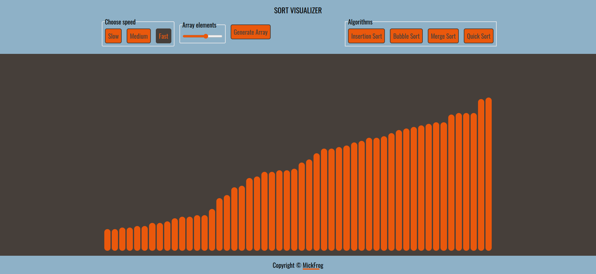
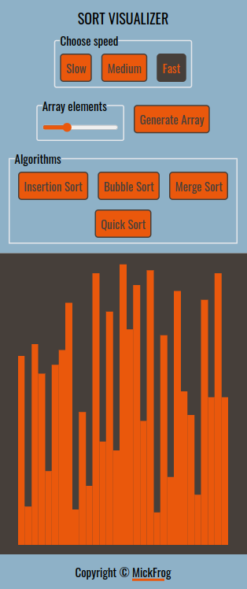

# Sort Visualizer

This is a project that aims to visualize different sorting algorithms at human conceivable speed.
The live app can be viewed [here](https://mickfrog.github.io/sort-visualizer).

## Features

1. Choose visualization speed from the app header.
2. Select the array size using a user-friendly slider.
3. Ability to generate new random array that is rendered to produce another set of div bars.
4. Select sorting algorithm.
5. All features are disabled during sorting visualization with the use of Promises.

## Project Preview

### Desktop Preview



### Mobile Preview



## Project Setup

```
git clone git@github.com:MickFrog/sort-visualizer.git
cd sort-visualizer
npm install
npm start
```

## Built with

- JavaScript
- JSX
- [React](https://reactjs.org/)
- [Tailwind CSS](https://tailwindcss.com/)
- CSS3
